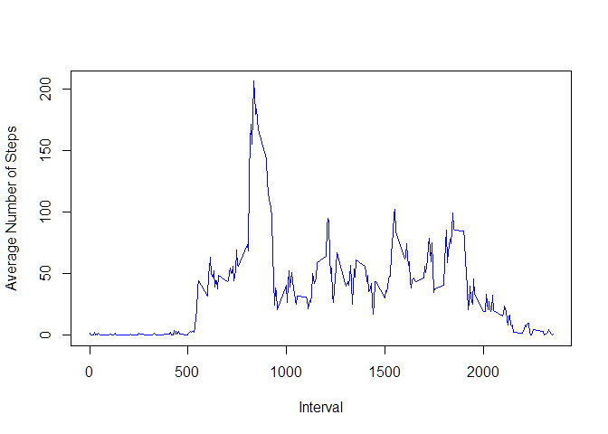

# Course Project 1

This is an R Markdown document for Course Project 1 of the Coursera 'Reproducible Research' course.  We are going to perform some data analysis on a data set collected from an activity monitoring device during two months in 2012, which include the number of steps taken in 5 minute intervals each day.

## Loading and preprocessing the data

First we need to read in the data set.


```r
if (!file.exists("activity.csv")) {
  unzip("repdata_data_activity.zip")
}
activitydf<-read.csv('activity.csv')
str(activitydf)
```

```
## 'data.frame':	17568 obs. of  3 variables:
##  $ steps   : int  NA NA NA NA NA NA NA NA NA NA ...
##  $ date    : Factor w/ 61 levels "2012-10-01","2012-10-02",..: 1 1 1 1 1 1 1 1 1 1 ...
##  $ interval: int  0 5 10 15 20 25 30 35 40 45 ...
```

```r
head(activitydf)
```

```
##   steps       date interval
## 1    NA 2012-10-01        0
## 2    NA 2012-10-01        5
## 3    NA 2012-10-01       10
## 4    NA 2012-10-01       15
## 5    NA 2012-10-01       20
## 6    NA 2012-10-01       25
```

The data appears to be in a tidy format with named columns so we will not perform any further processing at this stage.

## What is mean total number of steps taken per day?

1. *Calculate total number of steps per day, ignoring NA values.*

I use the aggregate function to sum the number of steps for each day, and return this in a data frame 'totalsteps':


```r
totalsteps<-aggregate(steps ~ date, data=activitydf, FUN=sum, na.rm=TRUE)
head(totalsteps)
```

```
##         date steps
## 1 2012-10-02   126
## 2 2012-10-03 11352
## 3 2012-10-04 12116
## 4 2012-10-05 13294
## 5 2012-10-06 15420
## 6 2012-10-07 11015
```

2. *Make a histogram of the total number of steps taken each day.*


```r
hist(totalsteps$steps,col="blue", xlab="Total Steps per Day",main = "Histogram of Steps per Day", breaks=15)
```


This plot shows the frequency for bins of total number of steps taken each day.  I tried a few 'break' numbers and decided 15 gave a good representation of this data.

3. *Calculate and report the mean and median of the total number of steps taken per day.*


```r
meansteps<-mean(totalsteps$steps)
```

The mean number of steps are 1.0766189\times 10^{4}.

The median number of steps are:


```r
mediansteps<-median(totalsteps$steps)
```

The median number of steps are 10765.

## What is the average daily activity pattern?

1. *Make a time series plot (i.e. type = "l") of the 5-minute interval (x-axis) and the average number of steps taken, averaged across all days (y-axis).*


```r
averagesteps<-aggregate(steps ~ interval, data=activitydf, FUN=mean,na.rm=TRUE)
plot(averagesteps$interval, averagesteps$steps, type = "l", col = "blue",
     xlab="Interval", ylab = "Average Number of Steps")
```



2. *Which 5-minute interval, on average across all the days in the dataset, contains the maximum number of steps?*


```r
maxsteps<-averagesteps$interval[which.max(averagesteps$steps)]
```

The interval with the maximum number of steps is 835. 

##Imputing missing values

1. *Calculate and report the total number of missing values in the dataset (i.e. the total number of rows with NAs).*


```r
totalna<-sum(is.na(activitydf$steps))
```

The total number of missing values in the data set is 2304.

2. *Devise a strategy for filling in all of the missing values in the dataset. The strategy does not need to be sophisticated. For example, you could use the mean/median for that day, or the mean for that 5-minute interval, etc.* 

While not particularly elegant, imputing the mean value is a standard practice. I will follow this and impute the missing data with the mean value for that interval, as that is more representative than taking the mean value for the whole day or dataset.

3. *Create a new dataset that is equal to the original dataset but with the missing data filled in.*


```r
activitydf.impute<-activitydf
for(i in 1:dim(activitydf.impute)[1]) {
  if(is.na(activitydf.impute[i,1])) {
    activitydf.impute[i,1]<-averagesteps[which(averagesteps$interval==activitydf.impute[i,3]),2]
  }
}  
head(activitydf.impute)
```

```
##       steps       date interval
## 1 1.7169811 2012-10-01        0
## 2 0.3396226 2012-10-01        5
## 3 0.1320755 2012-10-01       10
## 4 0.1509434 2012-10-01       15
## 5 0.0754717 2012-10-01       20
## 6 2.0943396 2012-10-01       25
```

Let's just check and see that all the missing data (NA's) are filled in:


```r
nacheck<-sum(any(is.na(activitydf.impute)))
```

There 0 NA values remaining in the dataset.

4. *Make a histogram of the total number of steps taken each day and calculate and report the mean and median total number of steps taken per day.* 


```r
totalsteps.impute<-aggregate(activitydf.impute$steps, by=list(date=activitydf.impute$date), FUN=sum)
hist(totalsteps.impute$x,col="blue", 
     xlab="Total Steps per Day",main = "Histogram of Steps per Day", breaks=15)
```


```r
meansteps.impute<-mean(totalsteps.impute$x)
```

The mean number of steps per day are 1.0766189\times 10^{4}.


```r
mediansteps.impute<-median(totalsteps.impute$x)
```

The median number of steps per day are 1.0766189\times 10^{4}.

*Do these values differ from the estimates from the first part of the assignment?*


```r
meandiff<-meansteps.impute-meansteps
mediandiff<-mediansteps.impute-mediansteps
diffna<-meansteps-mediansteps
diffimpute<-meansteps.impute-mediansteps.impute
```

There is a difference of 0 in the mean value, and a difference of 1.1886792 in the median value after imputing missing values.

*What is the impact of imputing missing data on the estimates of the total daily number of steps?*

When the data set ignores the missing values, the mean and the median differ by 1.1886792.  When I impute the missing values the mean and median differ by 0.

Looking at the histograms, by imputing the data the shape of the frequency distribution changes - the central peak is more pronounced.

It would be interesting to know if there are whole days of data lost due to missing values. 


```r
daysmissing<-length(totalsteps.impute$date)-length(totalsteps$date)
```

Imputing values gives us 8 additional days of data (which now contain only average values).

How many days contain NAs?


```r
nadf<-activitydf
nadf$steps<-is.na(nadf$steps)
nasteps<-aggregate(steps ~ date, data=nadf, FUN=sum)
nadays<-length(which(nasteps$steps>0))
```

There are only 8 days that contain missing values.  So we lost a full 8 due to missing values, that we got back by imputing the data.

#Are there differences in activity patterns between weekdays and weekends?

1. *Create a new factor variable in the dataset with two levels - "weekday" and "weekend" indicating whether a given date is a weekday or weekend day.*


```r
activitydf.impute$day<-weekdays(as.Date(activitydf.impute$date))
activitydf.impute$weekend<-ifelse(activitydf.impute$day== "Saturday" | activitydf.impute$day == "Sunday", "weekend", "weekday")
activitydf.impute$weekend<-as.factor(activitydf.impute$weekend)
head(activitydf.impute)
```

```
##       steps       date interval    day weekend
## 1 1.7169811 2012-10-01        0 Monday weekday
## 2 0.3396226 2012-10-01        5 Monday weekday
## 3 0.1320755 2012-10-01       10 Monday weekday
## 4 0.1509434 2012-10-01       15 Monday weekday
## 5 0.0754717 2012-10-01       20 Monday weekday
## 6 2.0943396 2012-10-01       25 Monday weekday
```

```r
str(activitydf.impute)
```

```
## 'data.frame':	17568 obs. of  5 variables:
##  $ steps   : num  1.717 0.3396 0.1321 0.1509 0.0755 ...
##  $ date    : Factor w/ 61 levels "2012-10-01","2012-10-02",..: 1 1 1 1 1 1 1 1 1 1 ...
##  $ interval: int  0 5 10 15 20 25 30 35 40 45 ...
##  $ day     : chr  "Monday" "Monday" "Monday" "Monday" ...
##  $ weekend : Factor w/ 2 levels "weekday","weekend": 1 1 1 1 1 1 1 1 1 1 ...
```

2. *Make a panel plot containing a time series plot (i.e. type = "l") of the 5-minute interval (x-axis) and the average number of steps taken, averaged across all weekday days or weekend days (y-axis).*


```r
library(lattice)
averagesteps.impute<-aggregate(steps ~ interval + weekend, data=activitydf.impute, FUN=mean)
xyplot(steps ~ interval | factor(weekend), data = averagesteps.impute, type = "l",
       xlab="Interval", ylab="Average Number of Steps",layout=c(1,2))
```


By comparing the activity patterns, it looks like more intense activity occurs early in the day on weekdays, but there is more activity overall over the course of the day on weekends.  This individual possibly has a desk job and gets out and about at the weekend.
